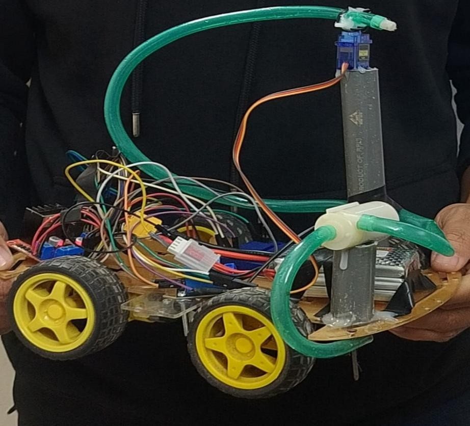
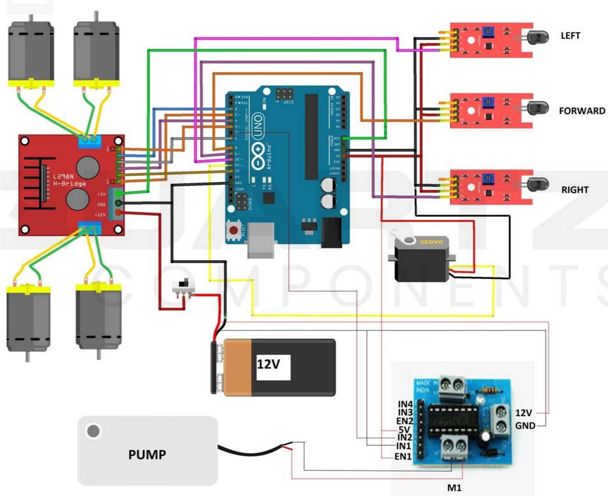

# 🔥 ESP8266 Firefighting Robot

A dual-mode (Manual + Automatic) firefighting robot using ESP8266 (NodeMCU) with IoT-based control and autonomous fire detection.

---

## 🚀 Features
- 🔥 Automatic fire detection using flame sensor
- 🤖 Autonomous firefighting system
- 📱 Web-based remote control (WiFi)
- 💧 Water pump activation system
- 🔄 Dual Mode: Manual + Automatic

---

## 🧠 How It Works
- In **Manual Mode**, user controls robot via web interface
- In **Automatic Mode**, robot detects fire and:
  - Moves forward
  - Activates water pump
  - Stops when fire is gone

---

## 🛠️ Components Used
- ESP8266 NodeMCU
- Flame Sensor (IR)
- L298N Motor Driver
- DC Motors (12V)
- Water Pump
- Relay Module
- Battery (5V + 12V)
- Chassis & Wheels

---

## 📷 Project Images
/images` folder and link here:

---

## 💻 Code
Code available in `/code` folder.

---

## 📄 Documentation
Full project report available in `/docs` folder.

---

## ⚡ System Highlights
- Web server hosted on ESP8266
- Automatic mode overrides manual control
- Fire detection range ~1.5m
- Response time ~2-3 seconds

---

## 🚧 Limitations
- Single direction fire detection
- No obstacle avoidance
- Limited water capacity

---

## 🔮 Future Improvements
- Add multiple sensors for direction detection
- Add obstacle avoidance
- Add ESP32-CAM for live video
- Smart navigation system

---

## 👨‍💻 Author
MD. ASIF HREEDOY  
IoT & Robotics Engineering Student
